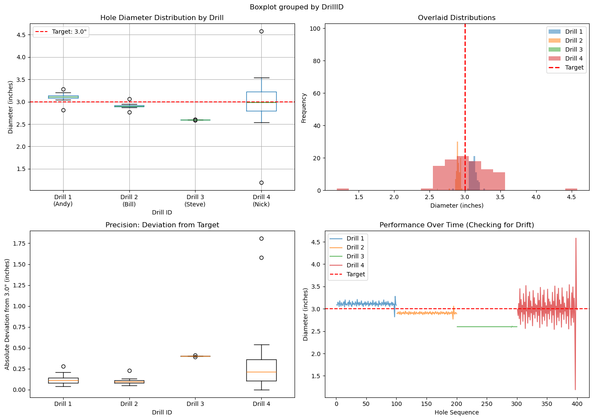

This demo is meant to help you think through problems.  The LLM's answer is NOT ALWAYS RIGHT.  


* Get the sample data from [here](https://raw.githubusercontent.com/davew-msft/vibe-analytics/refs/heads/main/drill_data.csv)
* You will need to load the data to your database.  Something like this usually works.  **Adjust for your environment as needed**

```text
I have some sample drill press data available here:  https://raw.githubusercontent.com/davew-msft/vibe-analytics/refs/heads/main/drill_data.csv

Load that data to a table called drillpressdata

```

Now you are ready to have conversations with the data

```text
Context: Our company manufactures BIG pieces of steel used to make bridge abutments. Part of what we do is drill big 3 inch holes into big pieces of steel so we can connect the abutments together. It is extremely expensive to drill holes in thick steel that are EXACTLY 3 inches. If the hole isn't EXACTLY 3 inches then we have to scrap the steel and that causes cost overruns.

We've had a lot of cost overruns lately so we decided to buy a new drill press to drill these holes. There are 4 vendors that make these drill presses and we've had each of them come out to our manufacturing site and setup their drill presses so we can try them out. It takes a few days for each of the vendors' engineers to setup the press and "zero it in" so it is ready for our testing.

The drills have similar published specs and similar prices. We simply need to know WHICH drill press drills the best 3 inch holes.

After each vendor told us their drill press was ready for testing we tested on Monday morning. Here's how we designed our experiment:

* Each machine was allowed to start and warm up for an hour
* We picked 4 of our "drill press operators" off the floor to help us, at random. 
* They were allowed one hour to learn the new drill they were assigned to.  We assigned each drill press a DrillID from 1 to 4.  
* The 4 operators were given 2 hours to drill 100 holes, labeled in the data as HoleID.  
* Each hole was to be representative of the expectation for the drill presses in production
  * 3 inch diameter hole through 6inch thick steel

We've looked at the results which is in `DrillPressData` table.  

Role: You are a data scientist well-versed in the manufacturing industry helping companies improve their manufacturing decisions. We've brought you in to help us make our capital purchasing decision - or - show us what we should be thinking about or doing wrong.

Interview: I am the Manufacturing VP. I want YOU to help me figure out the data from the experiment we conducted. Ask me any questions that may help you dive deeper and offer better recommendations.

Task: Which drill press should we buy? Can you give me a design of the analysis that will help us answer this question given the information in the DrillPressData table and the background context above? Keep the process high level and tell me what you are thinking. I'll ask follow-on questions as needed.

```


## Key Takeaways:

* Look at the data carefully.  You should also see a visualization like this:



* The LLM may recommend either Drill 2 or 3, but should NOT EVER recommend 1 or 4 b/c they are overdrilled.  
* The LLM usually says to choose Drill 2 (but YMMV).  **I think this is wrong**.  I think Drill 3 is the better choice.  Why?
  * It has the least variance and is clearly a setup issue.  
  * The LLM will usually tell me something similar but that Drill 2 is CLOSER to the goal of a 3" hole.  Again, IMO, that is wrong.  
* **This is why we want the LLM to guide us to making decisions and help us reason, we should not always expect the right answer.**