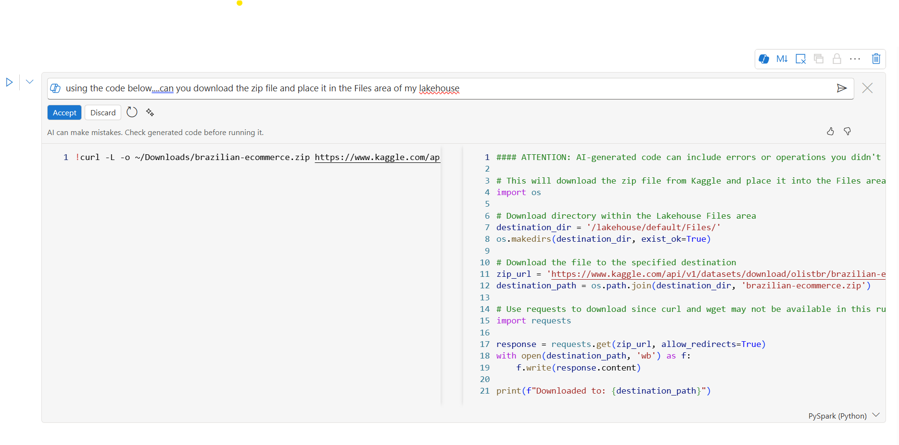
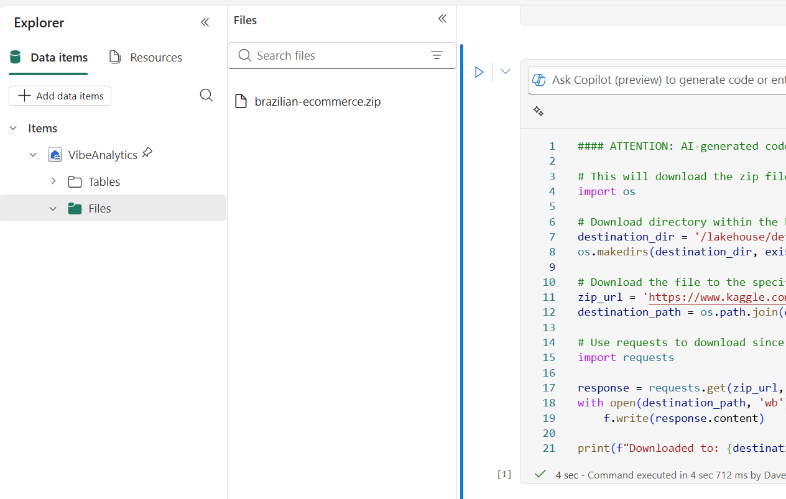
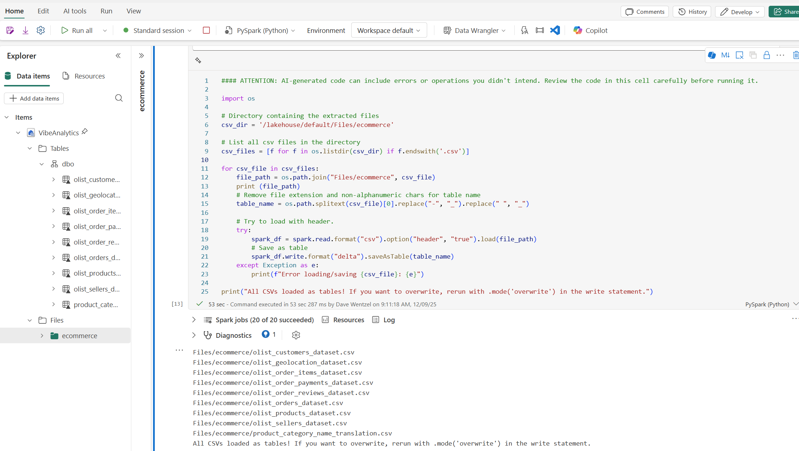

## Getting Data

For this demo, we need to get some sample data.  [Kaggle has a good ecommerce sample dataset](https://www.kaggle.com/api/v1/datasets/download/olistbr/brazilian-ecommerce) we can use.  You likely know nothing about it, that's good.  

Or, use your own data that's already loaded into Fabric.  

[If you want to load the data, follow these steps](data-loading.md)

Let's do this right from Fabric using Fabric Copilot:

Kaggle's website says this is the command to download the sample dataset:  

`curl -L -o ~/Downloads/brazilian-ecommerce.zip
https://www.kaggle.com/api/v1/datasets/download/olistbr/brazilian-ecommerce`

That's awesome, **but how do I do this with Fabric and lakehouses**.  

In Fabric:
* open a new notebook
* and a new lakehouse 
* Open a Copilot prompt on a cell and try this:  



That looks right.  Click `Accept`.

You should see this:



Now we say `can you unzip that file and place the contents in a folder under the Files section of my lakehouse, and call it "ecommerce"`

which gives us this:

```python
#### ATTENTION: AI-generated code can include errors or operations you didn't intend. Review the code in this cell carefully before running it.

import os
import zipfile

# Define paths
zip_path = '/lakehouse/default/Files/brazilian-ecommerce.zip'
extract_dir = '/lakehouse/default/Files/ecommerce'

# Create the output directory if it doesn't exist
os.makedirs(extract_dir, exist_ok=True)

# Extract the zip file into the ecommerce folder
with zipfile.ZipFile(zip_path, 'r') as zip_ref:
    zip_ref.extractall(extract_dir)

print(f"Extraction complete! Files are available in: {extract_dir}")
```

Next, we want to load the files to tables

Prompt:  `Now load each of those csvs as Tables.  Do your best guess as to datatypes and column names.  I have no idea if those files have headers or not`

The code generated is:

```python
#### ATTENTION: AI-generated code can include errors or operations you didn't intend. Review the code in this cell carefully before running it.

import os

# Directory containing the extracted files
csv_dir = '/lakehouse/default/Files/ecommerce'

# List all csv files in the directory
csv_files = [f for f in os.listdir(csv_dir) if f.endswith('.csv')]

for csv_file in csv_files:
    file_path = os.path.join("Files/ecommerce", csv_file)
    print (file_path)
    # Remove file extension and non-alphanumeric chars for table name
    table_name = os.path.splitext(csv_file)[0].replace("-", "_").replace(" ", "_")
    
    # Try to load with header.
    try:
        spark_df = spark.read.format("csv").option("header", "true").load(file_path)
        # Save as table
        spark_df.write.format("delta").saveAsTable(table_name)
    except Exception as e:
        print(f"Error loading/saving {csv_file}: {e}")

print("All CSVs loaded as tables! If you want to overwrite, rerun with .mode('overwrite') in the write statement.")

```

The output should look something like this:



Note:  we now have the tables loaded.  We are ready to do some _Guided Analytics_.  

## Why did we use Fabric Copilot for this?  

This is solely my preference and experience.  ghcp with `Claude Snnoet 4.5` does NOT seem to generate Fabric-aware code for data loading accurately.  

We are ready to go back to [Guided Analytics](./README.md)