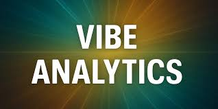

# Vibe Analytics:  Advancing Self-Service Analytics

  

Era of AI Day 
Thursday December 11, 2025  
Microsoft's Philadelphia Innovation Hub  

[See also:  nl2sql](https://github.com/davew-msft/nl2sql)  

## What is this?  Why are we here?

While "[Natural Language to SQL](https://github.com/davew-msft/nl2sql)" is great, we want to take this to the NEXT LEVEL.

_Vibe analytics_ builds on **vibe coding**, which is an informal, intuition-driven way of programming where you write code by "feeling out" the solution rather than following a strict plan. 

>As a business person, I want to be able to have conversations with my data _on my terms_.  I don't just need help writing SQL, I need help thinking through the entire _analytics process_.  I want the AI to help me find _nuggets of gold_ in my data and help me make good, data-driven decisions.  

So, what is the _analytics process_?  What should anyone (data scientists, data engineers, business analysts) understand when they are working with data?  

>The best data scientists have a process they follow to understand the data better so it can help them unlock value. What we attempt to do during this session is show you how I do it, but leveraging as little coding experience as possible.  Can an LLM do this for us?   

## _The Analytics Process_

I follow a process that the industry calls _Exploratory Data Analytics_.  EDA involves manually exploring, visualizing, and summarizing data to understand its various aspects. The goal would be to do this when you don't understand the data or want to ensure you aren't injecting your _biases_ and _preconceived notions_ into the data. LLMs can really help here. Most folks, even data scientists, even me, really struggle with EDA. You have to follow a process. LLMs and vibe coding can help you adhere to a good framework for doing this.

It helps in identifying patterns, detecting inconsistencies, testing assumptions, and gaining insights.

EDA also involves:  
  * data cleaning (it seems like our data is never perfect)
  * handling missing values
  * outlier detection 

This work is cumbersome and error-prone, even for the best data scientists and engineers. LLMs to the rescue!

## High Level Workflow

* Start with a [CRIT (Context, Role, Interview, Task) prompt](https://sgd.com.au/upgrade-your-ai-prompts-with-the-crit-framework/)
  * this expresses your intent
* observe intermediate results
* refine your thought processes and prompts
* discover patterns
* generate new knowledge and understanding

> This is exactly how a business person makes data-driven decisions.  We are simply using a prompt framework (CRIT) to provide structured guidance to the process, with the LLM being the enabler.  

### Why is this better than how we've done it for decades?

* We take static dashboards and metrics and turn them into dynamic dialogues that expose hidden meaning in the data.  
* We get true _prescriptive analytics_ (the data is telling us something..._what do we do next_)
* We are moving closer to _behaviorial analytics_ (How can I mold my customer decision-making processes?)

## What do I need to get started?

Right now...this works best using:  

* vscode
* Fabric (which has MCPs for vscode to assist with Vibe Analytics).  
  * **You do not need Fabric Copilot**
  * You can setup a Fabric workspace inexpensively for testing/personal work
* Spark notebooks/Jupyter notebooks
  * these work best because they have the ability to display visualizations, can connect to various data sources, etc

**While this is likely NOT IDEAL for business people to do analytics, it is not difficult to set these things up and it gives you the most flexibility**.  If you are interested, at the Microsoft Innovation Hub, we do additional sessions where we can show you have to set all of this up so the business user can simply use a browser to accomplish these tasks.  

[How to Setup Your Environment](./env-setup.md)

## 1. Demo with CRIT prompts

Let's look at some demos to show you the _Art of the Possible_.  

* [Here's an End-to-End Demo Using CRIT prompting and Guided Analytics techniques](./GuidedAnalytics/README.md)
  * We'll look at _Guided Analytics_ (which is just another term for EDA)
  * CRIT prompting
  * using Microsoft Fabric for Vibe Analytics (Guided Analytics)

## 2. Demo:  Can the LLM spot the problem with our data and recommend prescriptive actions?  

  Even more importantly, can you figure it out?  

  [Follow along in this Fabric Spark notebook](./CognitiveMistakes.ipynb)

## 3. 

todo:  

* ice cream sales:  https://github.com/davew-msft/infonomics/blob/master/Behavioral_Analytics.ipynb
* social media:  https://github.com/davew-msft/infonomics/blob/master/SocialMediaCampaignAnalytics.ipynb
  * https://github.com/davew-msft/MarketingAnalytics/blob/master/SocialMediaCampaignAnalytics.ipynb
* CLV:  https://github.com/davew-msft/MarketingAnalytics/blob/master/CustomerLifetimeValue.ipynb
  * CLV alt:  https://github.com/davew-msft/CustomerAnalytics/blob/master/CustomerLifetimeValue.ipynb
* LeadScoring:  https://github.com/davew-msft/MarketingAnalytics/blob/master/LeadScoring.ipynb
* Customer Segmentation analytics:  https://github.com/davew-msft/CustomerAnalytics/blob/master/CustomerSegmentationAnalytics.ipynb
* churn analytics:  https://github.com/davew-msft/CustomerAnalytics/blob/master/ChurnAnalytics.ipynb
* bank customer churn:  https://github.com/davew-msft/CustomerAnalytics/blob/master/BankCustomerChurn.ipynb
* WineEDA:  https://github.com/davew-msft/CustomerAnalytics/blob/master/WineEDA-python.ipynb
* Linear Programming/dwell analytics:  https://github.com/davew-msft/PrescriptiveAnalytics/blob/master/Prescriptive_Analytics.ipynb

wv/PrescriptiveAnalytics: may have stuff for the above

search for "Store Staffing" in 1note, this is very close to the q example in PrescriptiveAnalytics

search for "demand pricing" in 1note for example.

customer segmentation: search 1note for "custsegexample"

customer churn: search in 1note for "custchurnexample"

-------------

I'm a CPG company....can you explain "weighted ACV"
I'm a data scientist and I'd like to create a demo to describe ACV concepts to people that are not in the CPG space.  It should be something non-intuitive and maybe show a little "plot twist".  Any ideas?  I want to show this using AI and jupyter notebooks.  

FilePath = C:\dave\RefDocs\AI\Cognitive Computing Recipes.pdf
		Favorites [
			[
				Name = 5-3. Anomaly Detection: A Case of Fraudulent Credit Card Transactions
				PageNo = 285
				PageLabel = 264
			]
		]
		IsPinned = false

	FilePath = C:\dave\RefDocs\_unread\_suma\EconometricsAndDataScience.pdf
		Favorites [
			[
				Name = 9. Inflation Simulation
				PageNo = 213
			]
		]
		IsPinned = false

    C:\dave\RefDocs\_unread\_suma\Pricing.pdf
    C:\dave\RefDocs\_unread\_suma\Infonomics.pdf

    FilePath = C:\dave\RefDocs\_unread\_suma\AzureDatabricksCookbook.pdf
		Favorites [
			[
				Name = great demo to put in  my repo
				PageNo = 427

        FilePath = C:\dave\RefDocs\_unread\_suma\DesigningCloudDataPlatforms.pdf
		Favorites [
			[
				Name = ULID
				PageNo = 275
			]
		]

    FilePath = C:\dave\RefDocs\_unread\_analytics\The Model Thinker by Scott E. Page.pdf
		Favorites [
			[
				Name = 20 Spatial and Hedonic Choice
				PageNo = 305
			]
		]
		IsPinned = false

    		FilePath = C:\dave\RefDocs\_unread\_suma64\HowToMeasureAnything.pdf
		Favorites [
			[
				Name = The Concept of Measurement
				PageNo = 90
			]
			[
				Name = demo
				PageNo = 316
			]
			[
				Name = one of the most...
				PageNo = 323
			]
		]

    _suma and _suma1 are done (see above)

    FilePath = C:\dave\RefDocs\_unread\_suma64\LeanAnalytics.pdf
		Favorites [
			[
				Name = We’d Like to Hear from You
				PageNo = 18
			]
			[
				Name = Exploratory Versus Reporting Metrics
				PageNo = 38
			]
			[
				Name = What Is Good Enough?
				PageNo = 394
			]
			[
				Name = CAC, etc.
				PageNo = 408
			]
		]

    	FilePath = C:\dave\RefDocs\_unread\_analytics1\AppliedBusinessAnalytics.pdf
		Favorites [
			[
				Name = Analytics Rapid Prototyping
				PageNo = 148
			]
			[
				Name = People and the Decision Blinders
				PageNo = 154
			]
			[
				Name = Conclusion
				PageNo = 183
			]
			[
				Name = Conclusion
				PageNo = 184
			]
			[
				Name = Lever Settings and Causality in Business
				PageNo = 230
			]
		]

    		FilePath = C:\dave\RefDocs\_unread\_analytics\Killer Analytics.pdf
		Favorites [
			[
				Name = Chapter 8: The Sustainability Index
				PageNo = 168
			]
			[
				Name = Chapter 15: The Corporate Citizenship Index
				PageNo = 265
			]
		]

    	FilePath = C:\dave\RefDocs\_unread\_Next1\AnalyticalSkillsForAIandDataScience.pdf
		Favorites [
			[
				Name = O’Reilly Online Learning
				PageNo = 11
			]
			[
				Name = The Data Revolution
				PageNo = 18
			]
			[
				Name = Descriptive Analysis: The Case of Customer Churn
				PageNo = 24
			]
			[
				Name = Business Questions and KPIs
				PageNo = 25
			]
			[
				Name = Uncertainty from Simplification
				PageNo = 36
			]
			[
				Name = Revisiting Our Use Cases
				PageNo = 71
			]
			[
				Name = do after CLV calcs
				PageNo = 81
			]
			[
				Name = npv example
				PageNo = 84
			]
			[
				Name = Customer Churn
				PageNo = 86
			]
			[
				Name = example for notebook
				PageNo = 90
			]
			[
				Name = Optimal Staffing
				PageNo = 137
			]
		]

    	FilePath = C:\dave\RefDocs\_unread\_analytics1\HandsOnExploratoryDataAnalyticsWithPython.pdf
		Favorites [
			[
				Name = Download the example code files
				PageNo = 30
			]
			[
				Name = Comparing EDA with classical and Bayesian analysis
				PageNo = 65
			]
			[
				Name = Outlining Simpson's paradox
				PageNo = 412
			]
			[
				Name = Technical requirements
				PageNo = 554
			]
		]

    FilePath = C:\dave\RefDocs\_unread\_analytics\CompetingOnAnalytics.pdf
		Favorites [
			[
				Name = Five: Competing on Analytics with External Processes
				PageNo = 157
			]
			[
				Name = Five: Competing on Analytics with External Processes
				PageNo = 163
			]
			[
				Name = Five: Competing on Analytics with External Processes
				PageNo = 165
			]
			[
				Name = q example
				PageNo = 168
			]
			[
				Name = an example
				PageNo = 171
			]