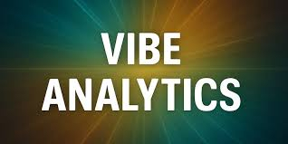

# Vibe Analytics:  Advancing Self-Service Analytics

  

Era of AI Day  
Microsoft's Philadelphia Innovation Hub  

[See also:  nl2sql](https://github.com/davew-msft/nl2sql)  

## What is Vibe Analytics?

**Vibe Analytics empowers business professionals to have intelligent conversations with their data—without writing code.**

### The Business Challenge

Every day, business leaders need to make critical decisions based on data. But accessing those insights typically requires:
- Submitting requests to overburdened IT or data science teams
- Waiting days or weeks for static reports and dashboards
- Learning complex SQL, Python, or business intelligence tools
- Hiring expensive consultants or data analysts

By the time you get your answer, the business question has often changed.

### The Vibe Analytics Solution

Vibe Analytics transforms how you interact with data by using AI to guide you through a natural, conversational analytics process—similar to how you'd work with an expert data analyst, but instant and on-demand.

**What makes it different:**
- **Have conversations with your data** using plain language—describe what you want to know, not how to query it
- **Get guided insights** as AI walks you through the entire discovery process, from data quality checks to actionable recommendations
- **Move beyond static reports** to dynamic exploration that adapts to what you're learning
- **Make confident decisions** backed by AI-assisted analysis that helps you avoid common analytical pitfalls and cognitive biases

### Real Business Value

Instead of just answering "what happened," Vibe Analytics helps you discover:
- **Hidden patterns** in your data that traditional dashboards miss
- **Prescriptive actions**—not just "here's what happened," but "here's what you should do next"
- **Root causes** behind the trends you're seeing
- **Predictive insights** about what's likely to happen next

>Think of it as having an expert data analyst working alongside you, available 24/7, helping you ask better questions and discover insights you didn't know to look for.   

## How It Works: The Guided Discovery Process

The secret behind Vibe Analytics is following the same proven process that expert data scientists use—called **Exploratory Data Analytics (EDA)**—but with AI as your guide so you don't need years of training.

### What AI Helps You Do:

**1. Understand Your Data**
- Automatically identify patterns, anomalies, and relationships
- Detect data quality issues before they lead to wrong conclusions
- Visualize trends in ways that make sense for your business questions

**2. Avoid Common Pitfalls**
- Stay objective by checking your assumptions against the actual data
- Identify outliers and anomalies that might skew your analysis
- Recognize when you're falling into cognitive biases (like confirmation bias or recency bias)

**3. Clean and Prepare Data**
- Handle missing or inconsistent data intelligently
- Merge data from multiple sources
- Transform messy data into analysis-ready insights

**Why This Matters:** Even the best business minds can reach wrong conclusions with data if they skip these critical steps. AI ensures you follow best practices automatically, without needing to become a data scientist yourself.

## Your Workflow: Simple and Natural

Using Vibe Analytics is as easy as having a conversation. Here's the process:

**1. Start with Your Business Question**
- Describe what you want to understand in plain language using the [CRIT framework](https://sgd.com.au/upgrade-your-ai-prompts-with-the-crit-framework/):
  - **Context:** What's the business situation?
  - **Role:** What's your perspective? (Sales leader, CFO, Marketing manager, etc.)
  - **Interview:** What specific questions do you have?
  - **Task:** What decisions do you need to make?

**2. Collaborate with AI**
- Review the insights and visualizations AI generates
- Ask follow-up questions as new patterns emerge
- Refine your understanding iteratively—just like brainstorming with a colleague

**3. Discover and Decide**
- Uncover hidden patterns you didn't expect
- Get recommendations for next steps
- Make data-driven decisions with confidence

>**This is exactly how business leaders should work with data**—starting with business questions, not database schemas. The AI handles the technical complexity while you focus on business insight and decision-making.  

### Why This Changes Everything

**From Static Reports to Dynamic Discovery:**
- Traditional dashboards show you what happened yesterday; Vibe Analytics helps you understand why it happened and what to do about it
- Transform one-way reporting into two-way conversations where each answer leads to better questions

**From Descriptive to Prescriptive:**
- Move beyond "sales were down 15%" to "sales declined because of X, Y, and Z—and here are three actions you should take immediately"
- Get AI-guided recommendations based on patterns in your specific business data

**From Generic to Personalized:**
- Stop forcing your business questions into pre-built dashboard templates
- Explore your data naturally, following your intuition and business context
- Uncover insights unique to your situation that standardized reports would never reveal

## What You Need to Get Started

**Good news:** You don't need to be a programmer or data scientist. Here's what you need:

### Quick Start (Recommended Setup)

The easiest way to start with Vibe Analytics today:

1. **VS Code** (free code editor from Microsoft)
   - Don't worry—you won't be writing code manually
   
2. **Microsoft Fabric** (cloud data platform)
   - Provides a cost-effective workspace for testing and personal use
   - Includes built-in data tools and visualizations
   - **Note:** You don't need "Fabric Copilot"—regular GitHub Copilot works great
   
3. **GitHub Copilot** (AI assistant)
   - Works inside VS Code to understand your questions and generate analysis

4. **Jupyter Notebooks** (interactive data environment)
   - Think of it as a smart canvas where you ask questions and see visual answers
   - Handles charts, graphs, and data connections automatically

### For IT/Technical Teams

The platform is flexible and works with multiple technologies:
- **IDEs:** VS Code (recommended), Jupyter environments
- **Compute engines:** Python, SQL, or Apache Spark with MCP server support
- **AI models:** GitHub Copilot, Azure OpenAI, or other coding agents
- **Data platforms:** Microsoft Fabric, Azure, or other cloud/on-premises data sources

[Detailed Setup Instructions](./env-setup.md)

### Deployment for End Users

While this demo uses VS Code, enterprise deployments can provide browser-based access so business users never need to install development tools. **Contact the Microsoft Innovation Hub** if you're interested in learning how to set up Vibe Analytics for your entire team.

## See It In Action: Real-World Examples

These demos show actual business scenarios where Vibe Analytics delivers insights that would be difficult or impossible with traditional tools.

### 1. Guided Discovery: End-to-End Business Analytics

See how to use natural language questions and the CRIT framework to explore data, uncover insights, and get actionable recommendations—without writing any code.

* **[Complete walkthrough: CRIT prompting + Guided Analytics](./GuidedAnalytics/README.md)**
  * Real example using Microsoft Fabric
  * Shows the complete process from business question to decision

### 2. Catching Critical Data Issues: AI-Powered Quality Checks

Can AI spot subtle data problems that even experienced analysts miss? **Can you?** This demo reveals common analytical pitfalls and shows how AI helps you avoid costly mistakes.

**[Interactive Demo: Cognitive Mistakes in Data Analysis](./CognitiveMistakes.ipynb)**

### 3. Real Marketing Insights: Survey Data Analysis

See how to analyze customer survey data to uncover sentiment patterns, preferences, and actionable marketing strategies—all through conversation with AI.

**[Marketing Survey Analytics Demo](./MarketingAnalytics/Marketing.ipynb)**

### 4. Excel Power User: Advanced Analytics Made Simple

Turn messy, poorly structured Excel files into powerful insights. Watch AI clean, restructure, and analyze data in ways that Excel alone can't handle.

**[Excel Data Analytics Demo](./excel-example/excel-example.ipynb)**
- Takes real-world "Excel chaos" and transforms it into clean, actionable insights

### 5. Beyond Analytics: Real-Time Data Engineering

For technical teams: See how Vibe principles apply to data engineering tasks like real-time streaming data processing—all with minimal manual coding.

**[Vibe Data Engineering with Spark Streaming](./Streaming-README.ipynb)**

---

## Ready to Transform Your Analytics?

Vibe Analytics represents a fundamental shift in how business professionals interact with data—from passive consumers of reports to active explorers of insights.

### Who Should Use Vibe Analytics?

- **Business Analysts** who need to answer complex questions without waiting for IT
- **Department Leaders** who want to make faster, data-driven decisions
- **Product Managers** seeking to understand customer behavior and market trends
- **Marketing Teams** analyzing campaign performance and customer insights
- **Finance Professionals** exploring trends and forecasting scenarios
- **Anyone** who has ever been frustrated by the gap between having a question and getting an answer

### Next Steps

1. **Try the demos** above to see what's possible
2. **Review the [setup guide](./env-setup.md)** to understand the technical requirements
3. **Explore [nl2sql](https://github.com/davew-msft/nl2sql)** for the foundation concepts
4. **Contact Microsoft Innovation Hub** to discuss enterprise deployment options

### Questions or Want to Learn More?

This work is developed and maintained by Microsoft's Innovation Hub team. We're actively helping organizations implement Vibe Analytics to democratize data access and accelerate decision-making.

**Vibe Analytics: Because your business questions shouldn't wait for technical translations.**