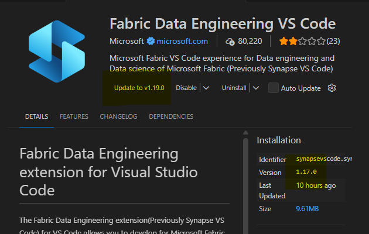

What you will need to follow along:  

* vscode
* Fabric extension (which includes the MCP server)
* Fabric Data Engineering Extension (this is the one I always use)
* a Fabric workspace where you are CONTRIBUTOR.  

>**If you are using Fabric and ghcp "hangs" on `Preparing...`, `Analyzing...` or `Processing...` ... this is a known bug in the vscode `Fabric Data Engineering` extension for AT LEAST versions v1.18 and v1.19.  Simply click the dropdown next to Uninstall and install `v1.17`.  See screenshot below.  I have not tested this with v1.20 or later.  I'm working with our groups in Microsoft to fix this.** 

