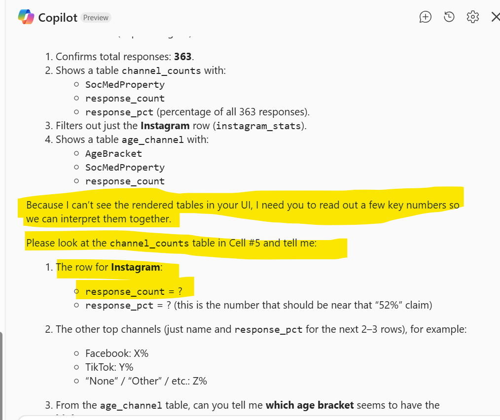

Issue with Fabric Data Engineering extension not working well with ghcp for Vibe Analytics.  

## Things tried/status

* think we need to use vscode in VFS mode.  Local mode requires miniconda or a lot of workarounds that aren't fully documented.  miniconda install is blocked by msit.  
* assuming:  
  * use as much of the standard fabric and vscode setup as possible.  
  * vscode ver 1.128 in user mode (note:  previous versions going back to maybe midMay have similar outcomes)
  * FDE extension is 1.25.  both vscode and FDE are set to auto-update

## Repro steps
1. setup the demo for [marketing analytics](../MarketingAnalytics/Marketing.ipynb)
2. All MCP servers are running.  I have a minimal number running. 
3. This happens on BOTH of my machines (so not machine specific)
  * But I do have setting sync on for vscode.  Just sayin.  
4. I create a new notebook from the web ux AFTER attaching a lakehouse.  LH is tiny, just a few small tables.  Click Open with vscode 
  * I assume this starts the necessary MCPs, tools, agents
  * Regardless, the outcome is the same if I open an existing notebook directly from the vscode with the FDE extension in VFS mode.   

how can I list which mcp servers are running for the default agent?  

Quick reference for what each state means
* Preparing → local: starting MCP servers, discovering tools, gathering context (Fabric agent's domain).
* Considering → remote: waiting on the model to think / respond.
  * Heavy reasoning model + large context = slow time-to-first-token. If the Fabric agent packed a big context (lakehouse schema, notebook summary) and you're on a deep-reasoning model (o-series / GPT-5 reasoning), it can "think" for a while with zero streamed output. This is the most common cause.
    * _All tests were done with Sonnet 4.5, just to be sure_.  Sonnet 4.5 is meant to be _fast to first token_.  
  * _Top Causes for an Indefinite Hang_
    * Context window blown out — if the Fabric agent stuffed a huge payload (big lakehouse schema + notebook + tool defs), the request can exceed limits and stall instead of erroring cleanly.
    * A bad/oversized tool schema from one of the Fabric MCP tools making the model request malformed.
      * not sure how I can test this further
      * I did take some steps in the prompt to **hopefully avoid this**.  
    * Expired Copilot auth token or a proxy/network hiccup on that window.
      * doubtful in my case
* (streaming) → tokens arriving.

Things to help testing:  
* Command Palette (Ctrl+Shift+P) → MCP: List Servers
* Open the Output panel (Ctrl+Shift+U)
  * ghcp chat
  * ghcp
* In the Chat view, click the tools icon ("Configure Tools")
  * If you're near or over the limit (you'll see a warning), disable MCP servers/tool sets you're not using for this task. This alone often fixes the "Preparing" stall.
* Palette → Developer: Show Running Extensions
  * Look at the Fabric Data Engineering extension — if activation time or CPU is high, it may be blocking context gathering (e.g. syncing lakehouse/kernel metadata).

**Note that something is wrong with the FDE or Fabric.  If I run _anything else_ using ghcp that is NOT against Fabric or the FDE then results come back quickly and accurately.  No issue.  Trying to figure out WHERE in the _Fabric process_ this is breaking down.**

## Repro Tests

### Fabric Notebook Agent 

* this appears to be the "default" config when you launch vscode from the spark notebook UI from Fabric.  
* The "Fabric Notebook" agent is a custom agent shipped by the Fabric Data Engineering extension (not the built-in Agent/Ask modes). Custom agents run their own logic during the "Preparing" phase — and this one is designed to pull in Fabric context: workspace info, lakehouse/table schema, notebook summary, and often a live call to Fabric APIs/MCP before your prompt is ever sent. If any of that context-gathering is slow (network round-trips to Fabric, auth token refresh, schema fetch on a big lakehouse), the whole turn sits on "Preparing" with no feedback — exactly your symptom.

 with the Fabric Notebook agent selected, submit a prompt, then watch the GitHub Copilot Chat output channel. The last line before the stall usually names the slow step (e.g. a fabric_notebookContext, workspaceInfo, or lakehouse/table-stats call).


#### Test 1:  Fabric Notebook Agent - Send `hello` only

* Sonnet 4.5
* wait until the notebook loads in the editor, then do `1+1` and execute to ensure I have a connection to fabric.  
* in a New Chat.... `hello`
* sits on "Thinking" for at least 10 minutes
* so this shouldn't be a problem with conversation history or prompt size, it must be something with the sysprompt, Fabric context, tool schemas, whatever.  

Trying again:
* Developer:  Set Log Level, ghcp chat, trace
* new chat, `hello`
* nothing germane in the ghcp chat output
* chat window sits for 7 minutes on "Analyzing".  Output:

```
Hello! I'm Fabric Copilot for Data Engineering — I can help you author, debug, test, and manage your Microsoft Fabric Notebooks and Spark Job Definitions directly in VS Code.

I see you have Notebook_8.ipynb open. How can I assist you today? I can help with:

Writing or modifying notebook code
Running and debugging cells
Accessing Fabric data (Lakehouses, OneLake)
Syncing notebooks with the Fabric portal
Answering questions about Fabric APIs and best practices
What would you like to work on?
```

* Running `hello` from the fabric ux in copilot is instantaneoius.  

The overhead lives in how the VS Code extension assembles/sends the request (or waits on something) before/around the model call. The most likely culprit is context bloat or a blocking local step on the VS Code side — e.g. the agent attaching a huge context (workspace/notebook/lakehouse) or stalling on the fdefs: remote filesystem — that the lean web UI simply doesn't do.


#### Test 2:  Fabric Notebook Agent - Send Full Vibe Analytics prompt


### Built-in Agent

_Use built-in Agent mode for general prompts, and only switch to the Fabric Notebook agent when you specifically need its Fabric-aware behavior (kernel/lakehouse-integrated help)._


## Interesting tidbits

* Found it. The plugin is enabled in two config files. It comes from the Windows Terminal "Intelligent Terminal / Agentic Terminal" feature and is wired into your Copilot CLI plugin set. I'll disable it in both the user settings and the managed config so it stops firing hooks immediately.
* One note: this plugin ships with the Windows Terminal "Intelligent/Agentic Terminal" feature, so a Windows Terminal update could re-add or re-enable it — worth re-checking settings.json if the ENOENT warnings reappear later.
* mv "c:\dave\git\local-work-folder"  "c:\dave\git\local-work-folder.bak-20260713"
* mkdir -p /mnt/c/Users/davew/FabricWork


## Prompt steps

* ensure the correct mcp's are running in the new session

you are a fabric spark notebook attached to a lakehouse named VibeAnalytics.  Show me the tables in that lakehouse.  Do all of your work in the spark notebook so we can track it

yes, you have permissions to always run all notebook cells


you are attached to a microsoft fabric spark notebook with an attached lakehouse called VibeAnalytics. Show me 5 rows from dbo.marketing_surveys. Show all of your work in the notebook. You have permission to execute all cells


## wip
let's skip the git thing.  I have a new issue.  On subsequent ghcp chats against Fabric....everything hangs.  repro steps:

* new notebook in fabric web ui
* open in vscode
* takes about 2 mins
* I open a new chat window and ask it 
you are a fabric spark notebook attached to a lakehouse named VibeAnalytics.  Show me the tables in that lakehouse.  Do all of your work in the spark notebook so we can track it
...takes a few minutes while the prompt is sitting on "Working"
...then I see this
I'll help you list the tables in the VibeAnalytics lakehouse. Let me first get the notebook context and then generate the appropriate code.

Good, I found the code examples tool. Now let me load the fabric notebook context tool and other necessary tools.

I need to find the fabric_notebookContextTool specifically. Let me search for it more specifically.

I need to find the fabric_notebookContextTool. Let me check what tools are available directly. Based on the instructions, I should be using fabric_notebookContextTool to get the notebook context. Let me try to search for it more directly.

Hmm, that didn't find anything. Let me try a different approach - maybe I should look for getting fabric notebook properties or configuration.

he tool_search isn't finding the fabric_notebookContextTool. Let me check if I can call it directly or if I need to approach this differently. Actually, looking at the notebook file path, I can see it's: fdefs:/Workspaces/MTC%20Fabric%20Dave%20West/Notebooks/Notebook_1/Notebook_1.ipynb

Let me try to read the notebook file first to understand its structure and then use the copilot_getNotebookSummary tool I found earlier.

...and then it sits on "Processing".  

I have the ghcp chat log open

---

# Investigation Report (Copilot-assisted, 2026-07-13)

_Everything below this line was added by the assistant. It does not modify any of the notes above._

## TL;DR — Root cause

The FabricNotebook agent has a **multi-minute baseline latency on every model round-trip inside VS Code**. It is reproducible with a bare `hello` (≈4 min after all other fixes; ≈7–10 min before them), while the **exact same prompt in the Fabric web UI is instant**. Because agentic operations (e.g. "run this cell") are made of **several stacked round-trips**, that per-call tax multiplies and the turn appears to hang. This residual latency lives in the **VS Code extension's request/agent path**, not in the model, the Fabric backend, the capacity, or the notebook.

Several *contributing* problems were found and fixed along the way (stale cache, orphaned hooks, tool availability). They reduced the time (≈7–8 min → ≈3–4 min) but did **not** eliminate the baseline.

## Environment

- VS Code 1.128 (user mode), auto-update on
- GitHub Copilot Chat 0.56.0
- Fabric Data Engineering (FDE) extension `SynapseVSCode.synapse` v1.25.0, auto-update on
- Model: Claude Sonnet 4.5 (fast-to-first-token; rules out reasoning latency)
- VFS mode (local mode blocked — miniconda blocked by MSIT)
- Reproduces on **two machines** (Settings Sync on)

## Chat state → phase reference (verified during this investigation)

| State | Where the time goes |
|---|---|
| Preparing | Local: MCP startup, tool discovery, context gathering |
| Considering / Thinking | Remote: waiting on the model round-trip |
| Analyzing / Evaluating | Running/processing a tool call, then a model round-trip |
| Processing | Agent fell back to reading over `fdefs:` and stalled |
| (streaming) | Tokens arriving |

## Findings, evidence, and status

### 1. Stale VFS cache — FIXED (big win)
- `synapse.localWorkFolderPath` was `c:\dave\git\local-work-folder`, **inside the large multi-root git tree**.
- FDE's `PersistentCacheService` validated **79 notebook artifacts** on load, taking **34–45 s** (per-artifact up to ~13 s). Evidence: `Fabric Data Engineering - Desktop.log`.
- The live workspace has ~10 notebooks. `.vfscache` held **79**: `MTC Fabric Dave` = **66 stale** (old workspace) + `MTC Fabric Dave West` = 13.
- Action: backed up the folder (reversible), and **moved the work folder out of the git tree** to `c:\Users\davew\FabricWork`.
- Result: startup validation shrinks to the live workspace only; overall latency dropped from ≈7–8 min → ≈3–4 min.
- **Bug for FDE team:** the VFS cache accumulates artifacts from *all* historically-opened workspaces and there is **no built-in "clear cache" command**.

### 2. Orphaned Windows Terminal agent hooks — FIXED (noise + minor per-event cost)
- `wt-agent-hooks` plugin (from Windows Terminal "Intelligent/Agentic Terminal") fired a PowerShell hook on **every** `UserPromptSubmit`, `PreToolUse`, `PostToolUse`, etc.
- Every spawn failed: `spawn C:\WINDOWS\System32\WindowsPowerShell\v1.0\powershell.exe ENOENT`.
- Disabling via the `enabled:false` flag in `settings.json`/`config.json` was **ignored** — the HookExecutor scans the plugin dir and loads `hooks.json` regardless. Fixed by emptying `hooks.json` (`{ "hooks": {} }`).
- **Bug (Copilot CLI/HookExecutor):** the `enabled:false` plugin flag does not stop hook discovery/execution.

### 3. Tool availability / `fabricNotebookContext` not found — PARTIALLY MITIGATED
- On multi-step turns the agent looped in `tool_search` for `fabric_notebookContextTool` and never found it, then fell back to reading the notebook over `fdefs:` → "Processing" hang.
- The FabricNotebook agent **declares its own tools** in `...\synapsevscode.synapse-1.25.0\copilot\agents\FabricNotebook.agent.md`, including `synapsevscode.synapse/fabricNotebookContext` and `fabric-notebook-mcp/*`. It only pulls `azure-mcp-server/search` — so this is **not** Azure-MCP tool overload.
- The thrash means the declared context tool **was not registered/available at prompt time** (provider not up, or a name mismatch vs. what the model was told to call).
- Manually **scoping MCP servers for the chat session** helped. Caveat: per-session tool selection is not durable and a custom agent re-asserts its declared tool list each session (editing the `.agent.md` is overwritten on extension update).
- **Bug for FDE team:** the agent's declared `fabricNotebookContext` / `fabric-notebook-mcp` provider is not reliably available when the agent runs, and the model's expected tool name does not match what's contributed.

### 4. Git service statting the lakehouse VFS — OPEN (deferred by user)
- `[GitServiceImpl][getRepositoryFetchUrls] Failed to read remotes from .git/config: Failed to stat lakehouse item`.
- Copilot's git-repo detection scans workspace folders and `stat`s items over the lakehouse VFS (slow/timeout-prone). Added `files.watcherExclude`/`search.exclude` for Lakehouse/SemanticModel/SQLDatabase/Tables/Files. Git auto-detection change was deferred (would affect the real `c:\dave\git` multi-repo workflow).

### 5. Baseline per-round-trip latency — ROOT CAUSE, UNRESOLVED
- After 1–4, a fresh-chat `hello` on the FabricNotebook agent still takes **≈4 minutes** in VS Code vs **instant in the Fabric web UI** (same notebook, account, capacity, backend).
- Ruled out: Spark cold-start (session was active), cell-output bloat (few cells, ~15 narrow rows), notebook size, conversation history (fresh chat), reasoning model (Sonnet 4.5), stale cache, hooks.
- Because "run a cell" = **N stacked round-trips** (get summary → evaluate → execute → process), the ≈4-min tax multiplies and the turn looks hung at "Evaluating".
- Evidence the model itself received the agent context and chose no tools yet still took minutes: earlier `hello` returned the agent's canned intro after 7 min with no tool calls, and the Copilot Chat trace showed nothing in the gap — indicating the cost is in the **VS Code agent/request path**, not the model call surfaced to Copilot's normal logging.

## Recommendations

**For the user (practical, now well-evidenced):**
1. Do interactive / agentic Fabric data work in the **Fabric web UI Copilot** — instant, tools wired in natively.
2. Use the **VS Code FDE extension for editing/sync** and non-agentic tasks; use **built-in Agent mode** (not the FabricNotebook agent) for general/coding prompts — fast, different path.
3. Keep the work folder **outside** any large multi-root workspace (done → `c:\Users\davew\FabricWork`).
4. Periodically confirm no stale workspaces re-accumulate in `.vfscache`.
5. Scope MCP servers per session when using the FabricNotebook agent.

**For the FDE / Fabric team (bug report items):**
1. **Baseline per-round-trip latency** in the VS Code FabricNotebook agent path — reproducible with `hello`; instant in web UI. Primary issue.
2. **No "clear cache" command**; VFS cache accumulates artifacts from all historically-opened workspaces and is validated on every load.
3. **Declared agent tool (`fabricNotebookContext` / `fabric-notebook-mcp`) not reliably available** at prompt time; model hunts for a name that isn't contributed and falls back to slow `fdefs:` reads.
4. **No progress feedback** during multi-minute waits, and the agent has **leaked raw chain-of-thought** into the transcript.
5. Copilot **git service `stat`s lakehouse VFS items** during context gathering (`getRepositoryFetchUrls` failure).

## Changes made to this machine during the investigation (all reversible)

- `synapse.localWorkFolderPath`: `c:\dave\git\local-work-folder` → `c:\Users\davew\FabricWork`
- Backup of old cache: `c:\dave\git\local-work-folder.bak-20260713-090048`
- `wt-agent-hooks/hooks/hooks.json` emptied to `{ "hooks": {} }`; plugin `enabled:false` in `.copilot\settings.json` and `config.json`
- Added `files.watcherExclude` / `search.exclude` for Fabric artifact globs in VS Code user `settings.json`


Why you can't do this in the browser.  
