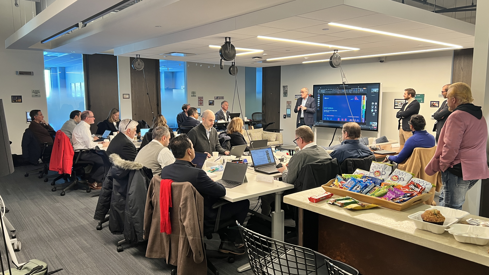

## "know-What" Before "Know-How"

Dave Wentzel  
Decision Architect  
Microsoft's Philadelphia Innovation Hub  
linkedin.com/in/dwentzel  

(TODO:  picture here...I'm getting new headshots done soon)

>Our _Data Scientist of the Year_ is awarded to Dave Wentzel from the Microsoft Innovation Hub.  Read our interview with Dave...

**Dave, tell us about your role at the Microsoft Innovation Hub?**

The MIH helps customers achieve business outcomes.  I get in trouble whenever I say this, but we're a _free service_ that helps our most forward-thinking customers achieve business outcomes, quickly, by leveraging our cloud services.  Specifically, I am a Decision Architect focused on Data, Analytics, and AI.  Selfishly, I use the learning from every engagement to provide feedback to our product teams to help make our products better.  

**What is a _Decision Architect_?**

I'm really one of those propeller-head, pocket protector-wearing _data scientists_ -- I love data, analytics, and statistics -- but that's not what I like to focus on.  Those topics tend to put people asleep.  Instead, I try to understand a customer's business problem first, then try to understand the _personas_ in the room, and then show them a process that will help guide them towards making the right decision, quickly.  So I like to focus on _People_ and _Process_ and less on _Technology_.  Decision architecture helps people make good decisions without removing their choices.  

**Can you describe the process you use?**

Many of our customers are new to Prescriptive Analytics and AI and they tend to focus on the wrong things.  They are concerned with "how do we setup an analytics environment" or "how do we secure our data" or "how do we ingest our Salesforce data to our data lake."  

While those topics are important, we still haven't talked about the business problem to be solved.  So many data professionals start first with the mechanical, IT concerns of a data project -- do I need a data lake or a warehouse, how do I do the semantic modeling, etc.  

I show them a different way.  Start first with a business problem.  Let's assemble the business people in a room and discuss the problem via _Design Thinking_ (DT) so we roughly know what data we need and approximately how we _might_ solve the problem.  

If you've ever done a DT session you know they can be a lot of fun.  We structure ours to foster open dialog about the business problem and try to gain consensus.  Then we try to solve the problem via a three day rapid prototype (RP).  

**Explain the Rapid Prototyping Process?**

Sure.  We try to scope the business problem down into something that we can solve in 3 days.  Not "Monday, Tuesday, Wednesday", but 3 days over the course of maybe a month or two.  Why?  Ugh, in 2025 the biggest reason for data project failures is STILL _data acquisition_.  It takes time.  As we progress through the RP we are constantly getting feedback from the stakeholders and further learning about the data and refining the business problem.  Occasionally we learn that we just can't solve the given problem and that's valuable learning too.  We can cancel the RP -- or what we usually do is pivot to a different problem.  What I'm describing is _Lean Management Principles_ ... fail fast, continuous learning, value maximization.  We do all of this without a huge investment - in both time and capital.  

The IT people love this approach, it's much more _agile_ than what most data teams do today.  But while we are focused on solving the business problem invariably all the _IT concerns_ will be surfaced organically -- how do we secure this data?  Do we even need a data warehouse?  How do we build this sustainably?  What tech do we need to deploy?  We effectively defer all of those decisions until we actually need to make them.  Most IT teams instead focus on architecture diagrams and upskilling their staff.  These activities could take months and meanwhile no business value is being created.  

And how do you think project sponsors react when they see the complex and busy Visio diagrams that are proposed for a given solution?  They think, "wow, this looks complex, expensive, and I'm not sure my existing talent can do this...this seems like it will be another failed data initiative.  I'm not going to fund this."  With our DT/RP Process we effectively flip this paradigm on its head.  And do you know what I say to those complex Visio diagrams?  YAGNI -- You Ain't Gonna Need It.  Start small, show value, iterate.  

**How does AI fit into all of this?**

Every customer we've talked to for at least the last 10 years tells us the same story.  "We want to be a data-driven company, we want self-service analytics, we want our departments to own and share their data and insights (data democratization), and we want to build _data products_".  The theme here is _decentralized analytics_.  

Before AI, this was possible, but difficult.  To really create business value you need to understand what I call "the data analytics process" -- roughly, you have to think about data like a data scientist does.  But not every company has a team of data scientists that can do this.  You can't give a business person unfettered access to a data lake and a dashboarding tool and expect them to create value.  For years I would give customers a template of how to think through any data problem, ensure the data was accurate, and show them how to think through problems, but it wasn't not easy.  

With AI, it actually IS easy.  What we do today is give the AI the context of the business problem and the data we have available, we tell the AI to think like a data scientist and confirm the data and begin exploring it with us.  We then tell the AI to have an "interview" dialog with the business people to help them clarify their thinking and help the AI understand the context of the data better.  This process works surprising well and as the User/AI dialog advances we begin to get to true "_what do we do now?_" prescriptive guidance.  

(a picture of a recent DT/RP session)

**Can you give us a recent example where this Design Thinking/Rapid Prototyping process worked?**

A construction supply company came to us with supply chain problems due to recently-enacted Chinese tariffs.  _"We can't ship all of the items by the RequiredDate and is this affecting sales?  How might we solve this?"_  We spent about a half day doing DT on the problem and they quickly came to the hypothesis that simply missing the promised delivery date likely wasn't affecting sales as much as they assumed.  But we needed to test that.  On the first day of the RP we, in fact, confirmed with the data that missing the RequiredDate for MANY customer segments just didn't matter.  This was eye-opening.  We quickly pivoted to focus on the customer segments where it DID matter.  We used the AI to help guide our conversations and analyze the data with us.  The AI helped us to uncover a lot of anomalies in the data that no one anticipated.  We had to pause our RP so the customer could gather some additional data and have interviews with some of their users.  Why was the data telling us this?  When we re-assembled a few weeks later we learned that there were far too many "custom orders for custom parts" being placed with their Chinese supplier simply because users could not search their product catalog for existing in-stock items.  We now knew what we needed to fix - the search capabilities of the web site.  AI to the rescue again.  We decided to shift the RP to fix that problem instead.  

The customer said they would've never uncovered that problem without looking at the data with us.  

**That's a great story.  What closing advice can you give our readers?**

First, in the Era of AI, stop thinking in terms of big IT capital projects, instead focus on quick wins and incremental gains until you uncover the truly big problems that require the capital project.  Ensure you are getting continuous feedback and you are _failing fast_.  Second, leverage your cloud vendor and their AI tools.  Most of these things can be spun up in a day and if you determine your use case isn't feasible you simply shut it down.  There's no need to worry about IT architecture and infrastructure and security _until you actually need to_.  If a vendor proposes an expensive 6 month capital project to solve your problem, run, don't walk, the other way.  

Lastly, customers ask me daily to help them find the best use cases for analytics and AI.  Don't overthink it.  Find out where your business people are using Excel today.  They are probably using it for the wrong reasons.  Most folks use Excel to gather data from disparate systems, harmonize it, do some rudimentary analytics, and then share it.  We can do it much more accurately, better, and repeatably with AI.  

**That's great advice. Thanks Dave**
