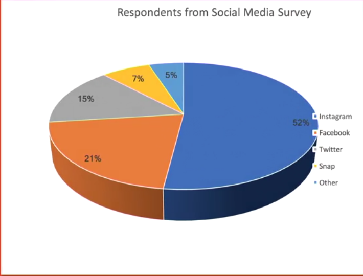
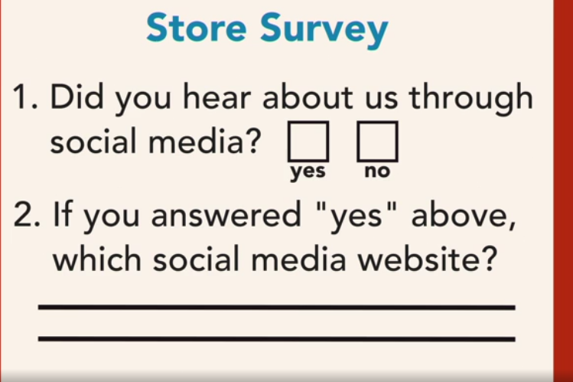

todo:  

* ice cream sales:  https://github.com/davew-msft/infonomics/blob/master/Behavioral_Analytics.ipynb
* social media:  https://github.com/davew-msft/infonomics/blob/master/SocialMediaCampaignAnalytics.ipynb
  * https://github.com/davew-msft/MarketingAnalytics/blob/master/SocialMediaCampaignAnalytics.ipynb
* CLV:  https://github.com/davew-msft/MarketingAnalytics/blob/master/CustomerLifetimeValue.ipynb
  * CLV alt:  https://github.com/davew-msft/CustomerAnalytics/blob/master/CustomerLifetimeValue.ipynb
* LeadScoring:  https://github.com/davew-msft/MarketingAnalytics/blob/master/LeadScoring.ipynb
* Customer Segmentation analytics:  https://github.com/davew-msft/CustomerAnalytics/blob/master/CustomerSegmentationAnalytics.ipynb
* churn analytics:  https://github.com/davew-msft/CustomerAnalytics/blob/master/ChurnAnalytics.ipynb
* bank customer churn:  https://github.com/davew-msft/CustomerAnalytics/blob/master/BankCustomerChurn.ipynb
* WineEDA:  https://github.com/davew-msft/CustomerAnalytics/blob/master/WineEDA-python.ipynb
* Linear Programming/dwell analytics:  https://github.com/davew-msft/PrescriptiveAnalytics/blob/master/Prescriptive_Analytics.ipynb

wv/PrescriptiveAnalytics: may have stuff for the above

search for "Store Staffing" in 1note, this is very close to the q example in PrescriptiveAnalytics

search for "demand pricing" in 1note for example.

customer segmentation: search 1note for "custsegexample"

customer churn: search in 1note for "custchurnexample"

-------------

I'm a CPG company....can you explain "weighted ACV"
I'm a data scientist and I'd like to create a demo to describe ACV concepts to people that are not in the CPG space.  It should be something non-intuitive and maybe show a little "plot twist".  Any ideas?  I want to show this using AI and jupyter notebooks.  

FilePath = C:\dave\RefDocs\AI\Cognitive Computing Recipes.pdf
		Favorites [
			[
				Name = 5-3. Anomaly Detection: A Case of Fraudulent Credit Card Transactions
				PageNo = 285
				PageLabel = 264
			]
		]
		IsPinned = false

	FilePath = C:\dave\RefDocs\_unread\_suma\EconometricsAndDataScience.pdf
		Favorites [
			[
				Name = 9. Inflation Simulation
				PageNo = 213
			]
		]
		IsPinned = false

    C:\dave\RefDocs\_unread\_suma\Pricing.pdf
    C:\dave\RefDocs\_unread\_suma\Infonomics.pdf

    FilePath = C:\dave\RefDocs\_unread\_suma\AzureDatabricksCookbook.pdf
		Favorites [
			[
				Name = great demo to put in  my repo
				PageNo = 427

        FilePath = C:\dave\RefDocs\_unread\_suma\DesigningCloudDataPlatforms.pdf
		Favorites [
			[
				Name = ULID
				PageNo = 275
			]
		]

    FilePath = C:\dave\RefDocs\_unread\_analytics\The Model Thinker by Scott E. Page.pdf
		Favorites [
			[
				Name = 20 Spatial and Hedonic Choice
				PageNo = 305
			]
		]
		IsPinned = false

    		FilePath = C:\dave\RefDocs\_unread\_suma64\HowToMeasureAnything.pdf
		Favorites [
			[
				Name = The Concept of Measurement
				PageNo = 90
			]
			[
				Name = demo
				PageNo = 316
			]
			[
				Name = one of the most...
				PageNo = 323
			]
		]

    _suma and _suma1 are done (see above)

    FilePath = C:\dave\RefDocs\_unread\_suma64\LeanAnalytics.pdf
		Favorites [
			[
				Name = We’d Like to Hear from You
				PageNo = 18
			]
			[
				Name = Exploratory Versus Reporting Metrics
				PageNo = 38
			]
			[
				Name = What Is Good Enough?
				PageNo = 394
			]
			[
				Name = CAC, etc.
				PageNo = 408
			]
		]

    	FilePath = C:\dave\RefDocs\_unread\_analytics1\AppliedBusinessAnalytics.pdf
		Favorites [
			[
				Name = Analytics Rapid Prototyping
				PageNo = 148
			]
			[
				Name = People and the Decision Blinders
				PageNo = 154
			]
			[
				Name = Conclusion
				PageNo = 183
			]
			[
				Name = Conclusion
				PageNo = 184
			]
			[
				Name = Lever Settings and Causality in Business
				PageNo = 230
			]
		]

    		FilePath = C:\dave\RefDocs\_unread\_analytics\Killer Analytics.pdf
		Favorites [
			[
				Name = Chapter 8: The Sustainability Index
				PageNo = 168
			]
			[
				Name = Chapter 15: The Corporate Citizenship Index
				PageNo = 265
			]
		]

    	FilePath = C:\dave\RefDocs\_unread\_Next1\AnalyticalSkillsForAIandDataScience.pdf
		Favorites [
			[
				Name = O’Reilly Online Learning
				PageNo = 11
			]
			[
				Name = The Data Revolution
				PageNo = 18
			]
			[
				Name = Descriptive Analysis: The Case of Customer Churn
				PageNo = 24
			]
			[
				Name = Business Questions and KPIs
				PageNo = 25
			]
			[
				Name = Uncertainty from Simplification
				PageNo = 36
			]
			[
				Name = Revisiting Our Use Cases
				PageNo = 71
			]
			[
				Name = do after CLV calcs
				PageNo = 81
			]
			[
				Name = npv example
				PageNo = 84
			]
			[
				Name = Customer Churn
				PageNo = 86
			]
			[
				Name = example for notebook
				PageNo = 90
			]
			[
				Name = Optimal Staffing
				PageNo = 137
			]
		]

    	FilePath = C:\dave\RefDocs\_unread\_analytics1\HandsOnExploratoryDataAnalyticsWithPython.pdf
		Favorites [
			[
				Name = Download the example code files
				PageNo = 30
			]
			[
				Name = Comparing EDA with classical and Bayesian analysis
				PageNo = 65
			]
			[
				Name = Outlining Simpson's paradox
				PageNo = 412
			]
			[
				Name = Technical requirements
				PageNo = 554
			]
		]

    FilePath = C:\dave\RefDocs\_unread\_analytics\CompetingOnAnalytics.pdf
		Favorites [
			[
				Name = Five: Competing on Analytics with External Processes
				PageNo = 157
			]
			[
				Name = Five: Competing on Analytics with External Processes
				PageNo = 163
			]
			[
				Name = Five: Competing on Analytics with External Processes
				PageNo = 165
			]
			[
				Name = q example
				PageNo = 168
			]
			[
				Name = an example
				PageNo = 171
			]

ice cream at convenience store:  behaviiraldataanalysis.pdf p31

hotel bookings behaviroaldataanalysis.pdf p 106

Pharma/Manufacturing

Why did GTN worsen for our blockbuster product last quarter?  

GTN is one of the hardest aspects for a proddev/manufacturer to analyze because the data is fragmented across finance, contracting, distribution, and various analytics systems.  Traditionally, to answer the GTN problem, data teams would build a series of dashboards to visually explain the data.  While that's interactive, it isn't _conversational_.  I can't explore the data and ask deeper questions, especially if key data elements are missing.  If I do expect this level of custom analysis it usually takes weeks to get on a data team's backlog and have them do the work.  While not perfect, being able to "vibe with the data" is getting a step closer for a business person to ask questions about the data BEFORE they get the data team involved.   

Context:  

We are a pharmaceuticals manufacturer.  Our blockbuster product is experiencing gross-to-net erosion over the last quarter.  Nobody seems to know why.  

* Finance blames rebates
* Sales blames contracts
* Ops blames returns

My analytics team is overworked and they can't really build us a dashboard to show causal reasons for GTN erosion because, frankly, we don't know where to begin looking.  I'm hoping we can do some preliminary work before we get them involved.  

Role:
You are a data scientist with 10 years of experience doing analytics in the pharmaceutical manufacturing space.  We've just brought you on-board as a consultant to help us with this analysis.  You should assume you are interacting with executives that likely do not know much about data, analytics, and data science, but do know a lot about their industry.  

Interview:
I am going to give you access to an initial dataset of the data we have available for recent transactions.  I want you to look at the data and ask me questions about it and I will hunt down the answers.  

Task:

I am going to give you 

First, design a high level 

Why is gross-to-net worsening?  
“Summarize the key GTN risks for Product A that leadership should focus on.”

“Which components drove most of the change?”
Ranks rebate, chargeback, returns impact
Shows delta contribution

“Rebates increased by 3.2 points, driven primarily by Specialty channel contracts.”

You pause and say:

“This normally takes a custom analysis request.”

ok, let's look at channel and contract analysis:

“Break that down by channel.”

ChatGPT:

Groups by Channel

Shows GTN % by channel

Highlights outliers

“Why did Specialty worsen?”

ChatGPT:

Identifies contract type or payer mix shift

Explains in words, not just numbers

User:

“Is this volume-driven or rate-driven?”

ChatGPT:

Compares:

Average rebate rate

Volume mix

Explains which effect dominates

Step 5: Forward-Looking Question

User:

“If Specialty volume grows another 10%, what happens to GTN?”

ChatGPT:

Applies simple scenario logic

Explains assumptions

Produces projected GTN

Important Callout

“This is not a black box forecast—it’s transparent and auditable.”

summary:

“Instead of a dashboard, we start with a question.”

“The user is now doing analytics, not consuming it.”

Old World	With ChatGPT
Static dashboards	Conversational exploration
Analyst bottleneck	User-driven analysis
SQL required	Natural language
Numbers only	Numbers + explanation
Long cycle time	Minutes

“This is deterministic math wrapped in a conversational interface.”

https://github.com/mariansiwiak/Generative_AI_for_Data_Analytics
Brazilian E-Commerce Public Dataset by Olist

CLV:
Instead of the constant retention rate found in some models
of CLV, we have purchase-occasion-specific rates.  
do this in the context of "I'm a banking evaluating a loan"  
maybe we do want customers to churn.  

What you might not be familiar with is how odds can be
applied to marketing analytics. What are the chances a
customer will buy your product versus the chances he or she
won’t? What are the chances you will retain a customer versus
the chances you will lose him or her?

search for "Store Staffing" in 1note, this is very close to the q example in PrescriptiveAnalytics

search for "demand pricing" in 1note for example.

customer segmentation: search 1note for "custsegexample"

customer churn: search in 1note for "custchurnexample"

end of ChurnAnalytics.ipynb

CLV in CustomerBehavioralanalytics.ipynb

finish wv/_custAnalytics

## Demos

### Guided Analytics
* VibeAnalytics Lakehouse
* list the tables in my fabric lakehouse

>Context:  
Look at my lakehouse.  You'll note I have 9 tables.  The data comes from a South American e-commerce company and the orders span approx 2016 to 2018.  You should assume the data is accurate but it's a good idea to verify any assumptions by actually querying the data.  

>Role:
You are a business analyst with 10 years of experience helping retailers and e-commerce companies improve their business processes.  You are starting a new consulting gig and you were given the above context about the data you want to use to help this company improve their business.  You have no additional information about this company.  

>Interview:

>I am the CEO of this company.  I want YOU to give me a list of FIVE potential research questions that you believe would be answerable given the datasets above.  After you give those to me I will pick a few with you and ask you to dive deeper.  

>Go!

>OK.  Let's look at this question:"What are the most popular product categories in terms of revenue, and how do their sales performance vary across different regions".  Can you give me a "design of the analysis" that would answer this question given the information provided?  Don't make assumptions about the data, what steps would you take to analyze the data at each step of the process?  Keep the process high level, I'll ask follow-on questions.  

> Can we look at market share calculations?  

> Can you recommend and create any visualizations for this data?  

### Marketing

In my lakehouse I have a csv file:  

Files/marketing-surveys/surveys.csv

Can you load that up to my lakehouse and create a table called dbo.marketing_surveys?

I frankly don't know what the data is, or the schema.  Just do your best guess for now.  We can fix it later.  

And the code to the last cell in this notebook.
---------------------------------------------------

Context:
Here is my business problem.  We just held a c suite meeting to discuss our marketing strategy.  Our CMO made this statement:  

> "Last quarter was the best quarter in our history. We crushed Wall Streets earning targets by a wide margin. I am POSITIVE that the key reason was our revamped digital advertising campaigns. Recently we conducted a comprehensive survey of our social media usage at our mall stores and it is apparent our Instagram presence is expanding.  52% of survey respondents said they learned about our company from Instagram.  We should double down on our Instagram ads to continue our earnings trajectory."

Everyone in the room, including me, was skeptical.  But we need hard data and analytics to prove it.  

Role:  
You are a marketing analytics data scientist with 10 years of experience in the retail space.  I want you to help me look through the data and, using your intuition and experience, help me understand if the CMO's statements are correct.  

Interview:  
I am the CEO of this retailer.  I want you to interview me and let's look at this data together.  I want YOU to ask me questions about my business, goals, etc, and let's reason through this problem together.  Feel free to ask me any questions that may help you dive deeper and offer better recommendations.  Work with me in a step-wise manner.  Let's look at each step together.  Assume I know nothing about data, analytics, and what a data scientist is or does.  

Task:
Should we invest more money in Instagram ad spend?  Or something else?  How much should we spend on Instagram ads?  Tell me what you are thinking at each step of the process and ask any follow-on questions as needed.  

The survey data is in a Microsoft Fabric table in a lakehouse attached to this notebook called "dbo.marketing_surveys".  I'm not sure what's in this table, but this is the data our CMO gave to us.  

------------------------------------------------------

Let me answer your questions and give you some additional context to consider:

* **my apologies for the data quality issues.  I doublechecked and the "20-Dec" data is an anomaly and a data quality issue.  My data people are idiots and they didn't load the data correctly.**
  * "20-Dec" should really be "12-20" for the "AgeBracket".  
  * Can you do me a favor?  It's going to take my data engineers another 6 months on a backlog to fix the data.  Can you just assume, for now that `"20-Dec" = 12-20` for the AgeBracket?  
* A little more about our business may help you.  
  * We are a retailer of **cold weather apparel** sold to mostly to the **Under 40** demographic.  
  * we are omni-channel but only about 20% of our receipts are from our shopping mall stores.  

I also just confirmed some things with the CMO about HOW her team conducted the interviews.  Here's the key findings:
* the surveys were only taken at one mall location in California.  
* the surveys were conducted **as the shoppers where leaving the store**
* in many cases the respondents would not give their actual age ranges and the folks conducting the surveys guessed at their age ranges.  
* the survey looked like this:  

Store Survey
1. Did you hear about us through social media?  Yes/No
2. If you answered "yes", which social media website?  

With this new information, can you provide any additional insights?  

### Drill Press